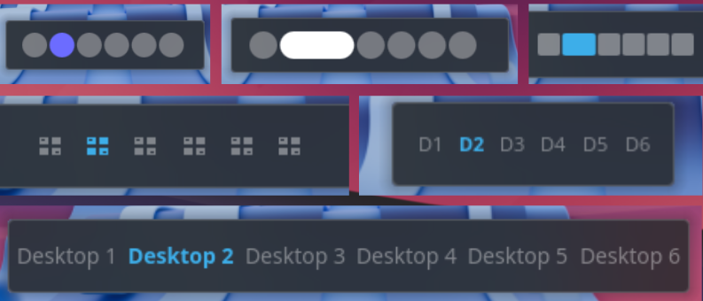

# Knome Workspace Switcher — GNOME-style Virtual Desktop Switcher for Plasma 6

**Knome Workspace Switcher** is a lightweight, GNOME-inspired virtual desktop switcher built specifically for **KDE Plasma 6**. It provides a clean, minimal interface to navigate your workspaces with support for dots, icons, desktop names, compact numbers, custom colors, animations, and mouse-wheel scrolling.



## Features

* **Minimalist UI**: Clean indicators with smooth animations for the active desktop.
* **Five Appearance Modes**:
  * **Circle**: Classic GNOME-style pill dots that expand for the active desktop.
  * **Square**: Modern square indicators.
  * **Desktop Name**: Displays actual desktop names from KWin (e.g., `Home`, `Work`), falling back to index numbers.
  * **Icon**: Compact desktop workspace icons with active highlight tinting.
  * **Desktop Number**: Compact labels (`D1`, `D2`, `D3`, …) bolded on the active desktop.
* **Highly Customizable**: Adjust dot/icon/font sizes (8–24px), spacing factor (0.1–0.9), and active bar dimensions.
* **Fixed Dot Count**: Option to display a fixed number of indicators regardless of virtual desktop count.
* **Custom Color Picker**: Pick any color via the native system color dialog or hex code (`#RRGGBB`).
* **Desktop Management**: Add or remove virtual desktops directly via the right-click context menu.
* **Mouse Wheel Navigation**: Switch desktops by scrolling over the widget with optional wrap-around.
* **Global Keyboard Shortcuts**: Configurable global shortcuts to switch to next/previous desktops.
* **Plasma 6 Native**: Built using modern Kirigami and Plasma 6 APIs.

## Configuration
Right-click the widget and select **"Configure Knome Workspace Switcher..."** to access all options:

| Section | Option | Description |
|---|---|---|
| Appearance | Shape | Circle, Square, Desktop Name, Icon, or Desktop Number |
| Appearance | Dot / Icon / Font Size | Indicator size in px (8 to 24px) |
| Appearance | Spacing Factor | Gap between indicators as a fraction of size (0.1 to 0.9) |
| Appearance | Side Margin | Left and right margin in px (0 to 10px) |
| Appearance | Active Width / Height | Size of the active dot bar (Circle and Square modes only) |
| Colors | Custom Colors | Enable custom active and inactive color overrides |
| Colors | Active / Inactive Color | Pick via color dialog or enter a hex code (`#RRGGBB`) |
| Behavior | Scrolling | Wrap around when scrolling past the last desktop |
| Behavior | Animation | Transition duration in milliseconds |
| Behavior | Desktop Management | Allow adding/removing desktops via context menu |
| Behavior | Fixed Dot Count | Display a fixed number of indicators (1 to 20) |
| Shortcuts | Next Desktop | Global shortcut to switch to the next desktop |
| Shortcuts | Previous Desktop | Global shortcut to switch to the previous desktop |

## Installation

### From .plasmoid Package
Install using `kpackagetool6`:
```bash
kpackagetool6 -t Plasma/Applet -i org.kde.plasma.knomeworkspaces-v2.3.plasmoid
```
To upgrade an existing installation:
```bash
kpackagetool6 -t Plasma/Applet -u org.kde.plasma.knomeworkspaces-v2.3.plasmoid
```
Or install via **Add Widgets > Get New Plugins > Install from File...** in Plasma.

### From Source
1. Clone the repository:
   ```bash
   git clone https://github.com/sakibreza229/org.kde.plasma.knomeworkspaces.git
   cd org.kde.plasma.knomeworkspaces
   ```

2. Copy the plasmoid files to your Plasma plasmoids directory:
   ```bash
   mkdir -p ~/.local/share/plasma/plasmoids/org.kde.plasma.knomeworkspaces
   cp -r contents metadata.json ~/.local/share/plasma/plasmoids/org.kde.plasma.knomeworkspaces/
   ```

3. Refresh the Plasma shell cache:
   ```bash
   kbuildsycoca6
   ```

## Requirements
- KDE Plasma 6.0+
- `plasma5support` package (provides the DataSource executable engine)

## License
This project is licensed under the GPL-3.0+ License.